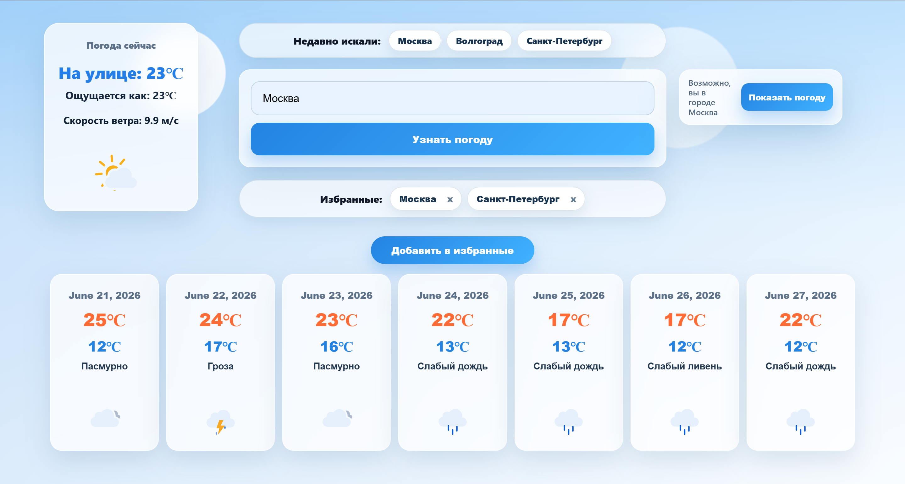
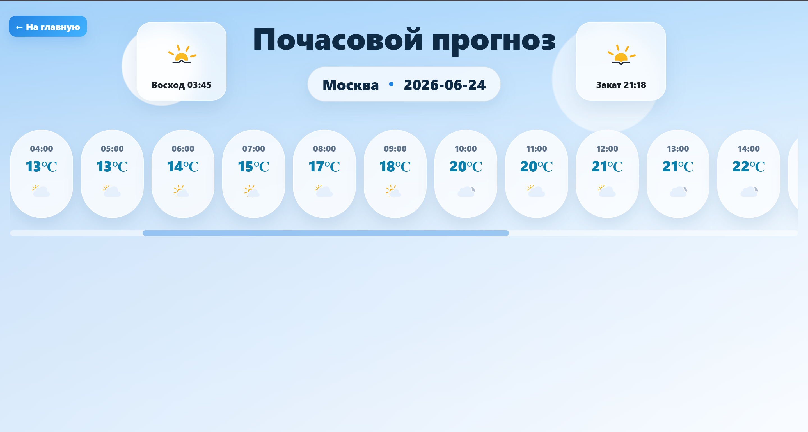

# Weather Dashboard

A server-rendered Go web application for checking weather forecasts by city.

The project uses Go HTML templates with HTMX for partial page updates, stores user-related data in SQLite, and uses Redis to cache external weather API responses.

## Screenshots

### Main dashboard



### Hourly forecast



## Features

- Search weather by city
- View current weather conditions
- View a 7-day forecast
- Open hourly forecast details for a selected day
- Save and remove favorite cities
- View recent search history
- Use an auto-detected city suggestion
- Update page sections dynamically without full page reloads

## Tech Stack

- Go
- Chi
- HTMX
- HTML templates
- CSS
- SQLite
- Redis
- Docker
- Open-Meteo API

## Technical Overview

The application is built as a server-rendered Go web app.

- HTTP routing is handled with Chi.
- Pages are rendered on the server using Go HTML templates.
- HTMX is used for partial page updates.
- Weather data is requested from the Open-Meteo API.
- Redis is used to cache external API responses.
- SQLite stores favorite cities and search history.
- Database migrations are stored in the `migrations/` directory.
- Configuration is provided through environment variables.
- The HTTP server supports graceful shutdown.
- Docker Compose starts the application and Redis together.

## Configuration

Before running the application, create a `.env` file from the example file:

```bash
cp .env.example .env
```

Example configuration for Docker:

```env
APP_ADDR=:8081
SQLITE_PATH=/data/weather.db
REDIS_ADDR=redis:6379
REDIS_PASSWORD=
REDIS_DB=0
```

| Variable | Description |
| --- | --- |
| `APP_ADDR` | HTTP server address inside the container |
| `SQLITE_PATH` | Path to the SQLite database file inside the container |
| `REDIS_ADDR` | Redis address inside the Docker Compose network |
| `REDIS_PASSWORD` | Redis password, if required |
| `REDIS_DB` | Redis database index |

## Running with Docker

Docker Compose starts the Go application and Redis.

```bash
docker compose up --build
```

The application will be available at:

```text
http://localhost:8081
```

SQLite data is stored in the local `data/` directory, which is mounted into the application container.

To stop the containers:

```bash
docker compose down
```

## Main Routes

| Route | Description |
| --- | --- |
| `/` | Main dashboard |
| `/weather` | Weather forecast for a selected city |
| `/weather/hourly` | Hourly forecast for a selected day |
| `/favorites` | Favorite cities |
| `/searchhistory` | Recent search history |
